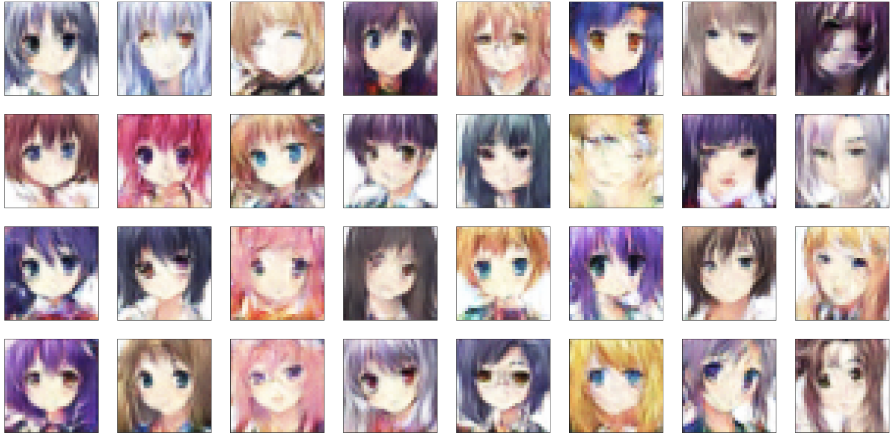

# Anime-GAN

This is a simple PyTorch implementation of a DCGAN, modified from a project in the Udacity DLND. The model is trained using an [Anime Faces dataset](https://www.kaggle.com/soumikrakshit/anime-faces) I found on Kaggle.

The architecture is simple, the discriminator and the generator each has 4 conv layers and 1 fully connected layer. This is a first attempt of creating a DCGAN. A lot of improvements can be made in the future.

## Instructions
1. Clone this repository and navigate to the folder.
   `git clone https://github.com/davidxuan/Anime-GAN.git`
   `cd Anime-GAN`

2. Use train_gan.ipynb to train the models.
   `jupyter notebook tran_gan.ipynb`

3. Use generate_samples.ipynb to load the models and generate some faces.
   `jupyter notebook generate_samples.ipynb`

4. If you wish to change the GAN architecture, modify model.py.